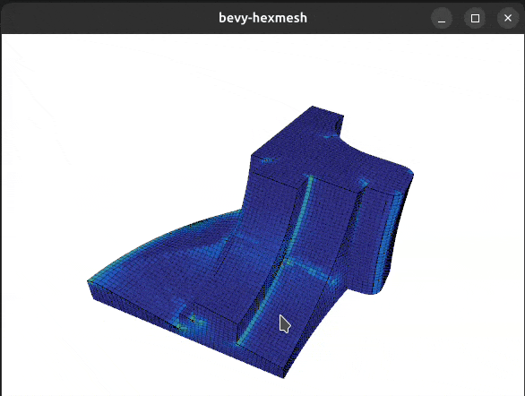

# bevy-hexmesh

[](https://gist.github.com/cheerfulstoic/d107229326a01ff0f333a1d3476e068d)

Render the surface of `input.mesh` with [Bevy](https://bevy.org/)



> [!NOTE]
> The goal of this project is more to provide me an use case for applying many of Rust's features than to share reusable code.

## Usage

```bash
cargo run
```

As input mesh, you can download one from [Hexalab](https://www.hexalab.net/), eg [this one](https://github.com/cnr-isti-vclab/HexaLab/blob/master/datasets/2020%20-%20Cut-enhanced%20PolyCube-Maps%20for%20Feature-aware%20All-Hex%20Meshing/fig10/fandisk_ours.vtk), and convert it with [meshio](https://github.com/nschloe/meshio).

## Documentation

You can open `diagram.excalidraw` with the open-source [Excalidraw.com](https://excalidraw.com/) whiteboard.

1. The hexmesh `input.mesh` is read
2. For each hexahedra, its deformation is measured (Scaled Jacobian)
3. The adjacency between cells is computed
4. The surface quad mesh is extracted, and its wireframe is stored as a set of edges
5. The surface is triangulated
6. Isolated vertices are removed
7. Remaining vertices are duplicated to have a single uv coordinate accross each triangle
8. The textured triangle mesh (the hexmesh surface) is rendered, alongside the quad mesh wireframe, with the Bevy engine